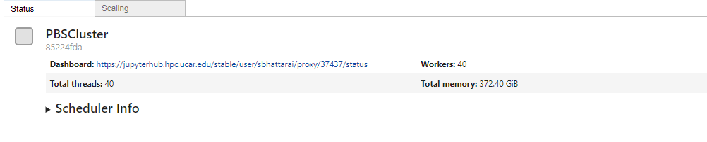

# Measure of parameter uncertainty using High Performance computing and Machine Learning
**The project output is in production and is not public as of now. The Dashboard should be available soon**

## Overview
This project leverages the power of supercomputing to handle and analyze extensive climate data produced by climate modeling at the National Center for Atmospheric Research (NCAR). The model used for this data is part of the Intergovernmental Panel on Climate Change (IPCC) climate prediction efforts. The shear volume size of the data is 4TB, which will be handled with cluster computing, resource provided by UCAR and UCSB.

## Objectives
The main goal of this project to use the principle of parameter uncertainty in quantifying the effects of each variables in a output. In simple term, the project will measure which variable has how much of influence.

## Methodology
1. **Data Handling**: Utilized supercomputing resources to process and manage the large volume of NETCDF climate data.
2. **Gaussian Regression**: Implemented Gaussian regression methods to estimate trend lines for every single variable within the dataset. This helped in visualizing the long-term trends and patterns in the data.
3. **Sensitivity Analysis**: Applied the Fourier Amplitude Sensitivity Test (FAST) to measure the sensitivity of the model outputs to various input variables. This helped in identifying which variables had the highest influence on the model predictions.

## Results
- **Trend Lines**: Generated visual trend lines for each variable using Gaussian regression, making it easier to observe the changes and trends over time.
- **Sensitivity Index**: Determined the most influential variables affecting climate predictions through the FAST sensitivity index, aiding in better understanding of the model's behavior and potential areas of focus for further research.

## Visualization
The visualizations created in this project allow for an intuitive and interactive exploration of the climate data, making complex datasets more accessible and comprehensible.

## Conclusion
This project demonstrates how machine learning and advanced data visualization techniques can enhance the interpretation of extensive climate modeling data, providing valuable insights for climate prediction and research.
